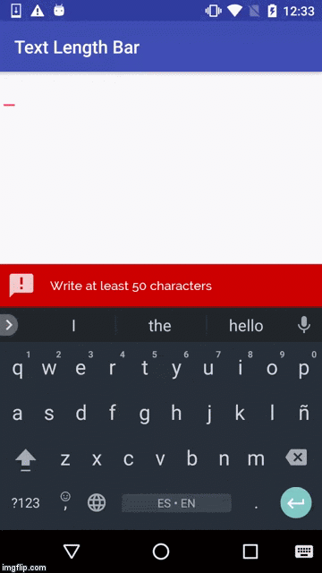

# TextLengthBar

TextLengthBar is an android library to manage EditText input count state.



# Features

  - Set TextLengthBar attributes on xml
  - Set TextLengthBar attributes programatically
  - Set TextLengthBar single state
  - Add multiples states to TextLengthBar


### Usage

Add TextLengthBar to your activity/fragment layout resource file with your empty text entry configuration (by attrs).

```
<?xml version="1.0" encoding="utf-8"?>
<RelativeLayout
    xmlns:android="http://schemas.android.com/apk/res/android"
    xmlns:app="http://schemas.android.com/apk/res-auto"
    xmlns:tools="http://schemas.android.com/tools"
    android:layout_width="match_parent"
    android:layout_height="match_parent"
    tools:context="minube.com.textlengthbar.MainActivity">

  <EditText
      android:id="@+id/edit_text"
      android:layout_width="wrap_content"
      android:layout_height="wrap_content"
      />

  <minube.com.library.TextLengthBar
      android:id="@+id/text_length_bar"
      android:layout_width="match_parent"
      android:layout_height="wrap_content"
      android:layout_alignParentBottom="true"
      app:barBackgroundColor="@android:color/holo_red_dark"
      app:barIcon="@drawable/ic_min_chars"
      app:barMinChars="50"
      app:barMessage="@string/default_message_content"
      app:barMessageTextColor="@android:color/white"
      app:textFontPath="fonts/Raleway-Medium.ttf"
      app:barMessageTextSize="14dp"/>

</RelativeLayout>
```

### Attrs

| Name | Format |
| ------ | ------ |
| barMessageTextColor | color |
| barBackgroundColor | color |
| barMessageTextSize | dimension |
| barMinChars | integer |
| barIcon | reference |
| barMessage | string |
| textFontPath | string |

### Set TextLengthBar attributes programatically

```
textLengthBar.setBackgroundColor(ContextCompat.getColor(this,android.R.color.black));
textLengthBar.setTextSize(20);
textLengthBar.setText("Message content");
textLengthBar.setTypeface("fonts/Raleway-Medium.ttf");
textLengthBar.setTextColor(ContextCompat.getColor(this,android.R.color.holo_red_dark);
```

### Working with multiple states
   - Configure your own states
   - Add states to TextLengthBar
   - Attach your EdtiText to TextLengthBar


```
public class MainActivity extends AppCompatActivity {

    @BindView(R.id.edit_text) EditText editText;
    @BindView(R.id.text_length_bar) TextLengthBar textLengthBar;

    @Override protected void onCreate(Bundle savedInstanceState) {
        super.onCreate(savedInstanceState);
        setContentView(R.layout.activity_main);
        ButterKnife.bind(this);

        textLengthBar.setStates(buildStates());
        textLengthBar.attachToEditText(editText);
    }

    private List<TextLengthBarState> buildStates() {

        List<TextLengthBarState> states = new ArrayList<>();

        states.add(new TextLengthBarState.Builder(100, "Add %d more characters for a great review.")
            .backgroundColor(R.color.first_state_color)
            .icon(R.drawable.ic_first_step)
            .build());

        states.add(new TextLengthBarState.Builder(150, "Help others by adding %d more characters.")
            .backgroundColor(R.color.second_state_color)
            .icon(R.drawable.ic_second_state)
            .build());

        states.add(new TextLengthBarState.Builder(200, "You're doing great.")
            .backgroundColor(R.color.third_state_color)
            .icon(R.drawable.ic_third_state)
            .build());

        return states;
    }
}
```

Note: If you want to draw pendings chars to change to the next state you need to place "%d" on your state message

### Working with single state
Simply set your own state and atach TextLengthBar to EditText

```
textLengthBar.setState(new TextLengthBarState.Builder(100, "Great experience")
            .backgroundColor(R.color.first_state_color)
            .icon(R.drawable.ic_first_step)
            .build());

textLengthBar.attachToEditText(editText);
```

### Notes
If you want to push up TextLengthBar with the keyboard don't forget to add the following line into your AndroidManifest file within your Activity declaration:

```
android:windowSoftInputMode="stateVisible|adjustResize"
```

Furthermore you need to add the following line to TextLengthBar xml declaration:
```
android:layout_alignParentBottom="true"
```

### Gradle

```
dependencies {
  compile 'com.github.minube:Text-Length-Bar:beta-1.0'
}
```